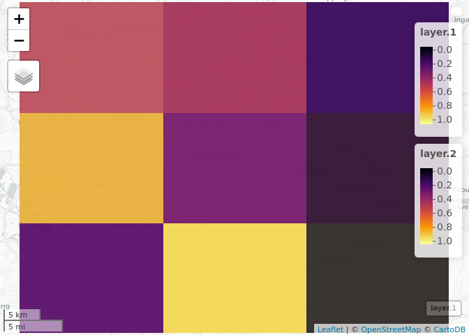

<!-- README.md is generated from README.Rmd. Please edit that file -->

# bdformats

In raster:

``` r
library(raster)
#> Loading required package: sp
region = sf::as_Spatial(spData::lnd)
raster(region)
#> class      : RasterLayer 
#> dimensions : 10, 10, 100  (nrow, ncol, ncell)
#> resolution : 0.08443906, 0.0405114  (x, y)
#> extent     : -0.5103751, 0.3340155, 51.28676, 51.69187  (xmin, xmax, ymin, ymax)
#> crs        : +proj=longlat +datum=WGS84 +no_defs +ellps=WGS84 +towgs84=0,0,0
r = raster::raster(spData::lnd, ncols = 3, nrows = 3)
raster::values(r) = runif(9)
raster::plot(r)
```

<!-- -->

``` r
r2 = raster(r)
values(r2) = runif(9)
# b = brick(system.file("external/rlogo.grd", package="raster"))
b = brick(r, r2)
plot(b)
```

<!-- -->

``` r
m = mapview::mapview(b)
m@map
```

<!-- -->

In mapdeck:

``` r
df = data.frame(
  lng = runif(1000, 0, 1),
  lat = runif(1000, 52, 53)
  )
library(mapdeck)
ms = mapdeck_style("dark")
mapdeck(style = ms, pitch = 45, location = c(0, 52), zoom = 4) %>%
add_grid(data = df, lat = "lat", lon = "lng", cell_size = 10000,
         elevation_scale = 50, layer_id = "grid_layer",
         colour_range = viridisLite::plasma(6))
```

<!-- -->
