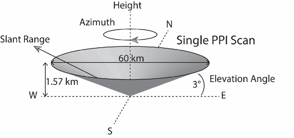
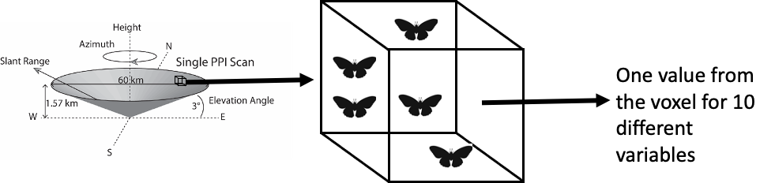

## Understand .h5

`/dataset1/data1/data` has what is in `dataset1/data1/what` which in our case is a 360x425 matrix explained here by Chris.

<div style="width:100%; background-color:#f00">
<table style="width:100%;">
<thead>
  <tr>
    <th></th>
    <th></th>
    <th colspan="5">Angles from due north</th>
  </tr>
</thead>
<tbody>
  <tr>
    <td></td>
    <td></td>
    <td>1</td>
    <td>2</td>
    <td>3</td>
    <td>...</td>
    <td>360</td>
  </tr>
  <tr>
    <td rowspan="5">Distance <br>from radar</td>
    <td>1</td>
    <td colspan="5" rowspan="5">Values in the matrix give the values for the radar variable – dataset1/data1/what tells you what the variable is under “quantity”. dataset1/data1, dataset1/data2, etc, give the 10 different radar variables.</td>
  </tr>
  <tr>
    <td>2</td>
  </tr>
  <tr>
    <td>3</td>
  </tr>
  <tr>
    <td>...</td>
  </tr>
  <tr>
    <td>425</td>
  </tr>
</tbody>
</table>
</div>

> If you convert the matrix to a long format with the distance (called “range”) and angle (“theta”) then use some trigonometry (https://github.com/biodar/bdformats/commit/20502b63b6f252c26e1eddf4487b25379bc50a54) then you can plot the coordinates (I haven’t incorporated the height):

```{r chris-code}
library(rgdal)
library(rhdf5)

f <- "https://github.com/biodar/bdformats/releases/download/1/sample.h5"
if(!file.exists(basename(f))) {
  download.file(f, destfile = basename(f))
}
# Load in example dataset
testData<-h5read(basename(f),"/dataset1/data1/data")
str(testData)

# Turn matrix into long format, add angles and distances from radar to build polar coordinates
data.df<-data.frame(value=as.vector(testData),theta=rep(c(1:360),425),radius=rep(c(1:425),each=360))

# Extract lat and long of the radar from the /where data in the h5 file
RadarLoc<-h5readAttributes(basename(f),"/where")
# Trigonometry to calculate x and y coordinates of each point in the scan
# note that the scan is a single elevation, so treating it as flat for now)
data.df$x = data.df$radius*cos(data.df$theta)
data.df$y = data.df$radius*sin(data.df$theta)

# Now calculate the change in latitude and longitude for each of those points
# https://stackoverflow.com/questions/2187657/calculate-second-point-knowing-the-starting-point-and-distance
delta_longitude = data.df$x/(111320*cos(RadarLoc$lat))  # dx, dy in meters
delta_latitude = data.df$y/110540                       # result in degrees long/lat

# Calculate the lat and long of each point in the radar scan
data.df$lat  = RadarLoc$lat+delta_latitude
data.df$long = RadarLoc$lon+delta_longitude

# Where value is zero, assuming NoData
data.df$value[data.df$value==0]<-NA

# Quick plot - big dataset!
plot(data.df$x,data.df$y,cex=0.1)

# Quick plot - big dataset!
plot(data.df$long,data.df$lat,cex=0.1)

# Apply the value offest to convert the integer values stored in the h5 dataset back to the radar variable
# The gain and offset are in the "what" part of the h5 data1 dataset
#   :gain = 0.1; // double
#   :offset = -32.0; // double
# I am not sure if I have applied them correctly here...
data.df$value<-(data.df$value*0.1)-32

# Make dataset smaller by removing points further than 5km from the radar
data.df.small<-subset(data.df,data.df$radius<50)

# Plot the smaller dataset
plot(data.df.small$x,data.df.small$y,cex=0.1)


# Mapping the dataset with static ggplot2 maps
# Based on https://bookdown.org/yann_ryan/r-for-newspaper-data/mapping-with-r-geocode-and-map-the-british-librarys-newspaper-collection.html
library(ggplot2)
worldmap = map_data('world')
ggplot() + 
  geom_polygon(data = worldmap, aes(x = long, 
                                    y = lat, 
                                    group = group), 
               fill = 'gray90', 
               color = 'black') + 
  coord_fixed(ratio = 1.3, 
              xlim = c(-10,3), 
              ylim = c(50, 59)) + 
  theme_void() +
  geom_point(data=data.df, 
             aes(x=long, 
                 y=lat,
                 color=value)) +
  scale_color_gradient(low="blue", high="red")

# devtools::install_github("ATFutures/geoplumber")
# install.packages(sf)
# data.df.sample <- data.df[sample(nrow(data.df), 5e3),]
# data.sf <- sf::st_as_sf(data.df.sample, coords=c("long", "lat"))
# geoplumber::gp_map(data.sf)
# lf <- geoplumber::gp_map(data.sf, browse_map = FALSE)
# htmltools::includeHTML(lf)


# Something a bit fancier based on Mapbox
# Based on Robin's work https://geocompr.robinlovelace.net/adv-map.html
# library(mapdeck)
#set_token(TOKEN)
# ms = mapdeck_style("light")
# mapdeck(style = ms, pitch = 45, location = c(0, 52), zoom = 4) %>%
# add_pointcloud(
#   data = data.df, lat = "lat", lon = "long",
#   radius = 5,
#   fill_colour = "value",
#   palette = "viridis",
#   na_colour = "#808080FF",
#   legend = TRUE,
#   legend_options = NULL,
#   legend_format = NULL,
#   update_view = TRUE,
#   focus_layer = FALSE,
#   digits = 6,
#   transitions = NULL,
#   brush_radius = NULL
# )
```
## hdf5r

```{r read}

library(rhdf5)
df = h5ls(basename(f))
class(df)
head(df)
d = h5read(basename(f), "dataset1/data1/data")
class(d)
nrow(d)
length(d)
```

## Calculating Z for each data point
from Chris and Maryna's emails:

425 are the different distances, and I think they might be 100m [600m] intervals (i.e. the furthest is 42.5km[100m*425] from the radar).
 
1 – The z is contained in the filename (b0 = lowest elevation, b1 = next elevation, etc). However, I don’t know the scanning angle associated with each of the elevations. Maryna? Obviously it will be another piece of trigonometry to calculate the heights at each distance, because the scan is always increasing in height away from the radar. Indeed, the z also needs to be included in the x,y calculations because the elevated beam means that the range actually travels a shorter distance relative to the ground:



2 – The “PPI” scan has a conical structure and scans the volume of air within that cone. What we get is a general scan of each region (voxel) within that volume. The radar then reports 10 different variables for each voxel. The radar doesn’t pick up individual objects.


3 - bioRad::beam_height
height of radar voxels should be calculated applying 4/3 refraction model
you can find beam height calculation in beam_height function 
https://github.com/adokter/bioRad/blob/master/R/beam.R
beam_height(range, elev, k = 4/3, lat = 51, re = 6378, rp = 6357
This is how to call the function with our latitude
The description can be found here
http://adriaandokter.com/bioRad/reference/beam_height.html