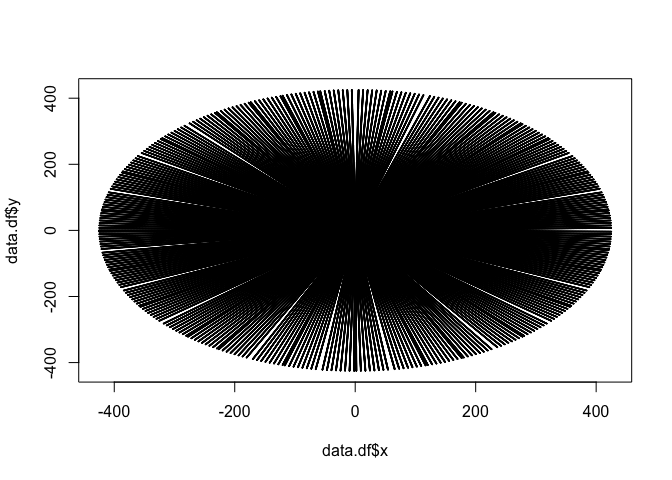
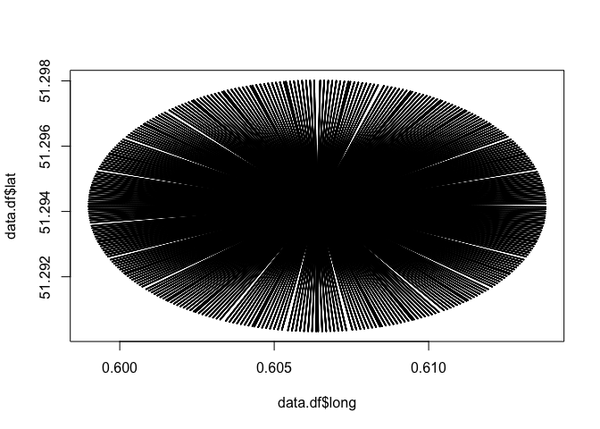
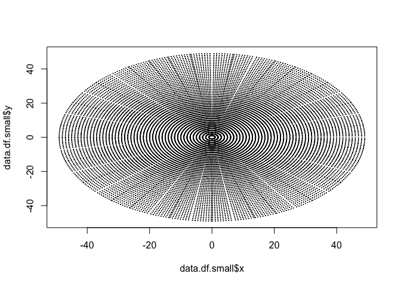

Going from hdf5 to ?
================

## Understand .h5

`/dataset1/data1/data` has what is in `dataset1/data1/what` which in our
case is a 360x425 matrix explained here by Chris.

<div style="width:100%; background-color:#f00">

<table style="width:100%;">

<thead>

<tr>

<th>

</th>

<th>

</th>

<th colspan="5">

Angles from due north

</th>

</tr>

</thead>

<tbody>

<tr>

<td>

</td>

<td>

</td>

<td>

1

</td>

<td>

2

</td>

<td>

3

</td>

<td>

…

</td>

<td>

360

</td>

</tr>

<tr>

<td rowspan="5">

Distance <br>from radar

</td>

<td>

1

</td>

<td colspan="5" rowspan="5">

Values in the matrix give the values for the radar variable –
dataset1/data1/what tells you what the variable is under “quantity”.
dataset1/data1, dataset1/data2, etc, give the 10 different radar
variables.

</td>

</tr>

<tr>

<td>

2

</td>

</tr>

<tr>

<td>

3

</td>

</tr>

<tr>

<td>

…

</td>

</tr>

<tr>

<td>

425

</td>

</tr>

</tbody>

</table>

</div>

> If you convert the matrix to a long format with the distance (called
> “range”) and angle (“theta”) then use some trigonometry
> (<https://github.com/biodar/bdformats/commit/20502b63b6f252c26e1eddf4487b25379bc50a54>)
> then you can plot the coordinates (I haven’t incorporated the height):

``` r
library(rgdal)
```

    ## Loading required package: sp

    ## rgdal: version: 1.5-23, (SVN revision 1121)
    ## Geospatial Data Abstraction Library extensions to R successfully loaded
    ## Loaded GDAL runtime: GDAL 3.2.1, released 2020/12/29
    ## Path to GDAL shared files: /Library/Frameworks/R.framework/Versions/4.0/Resources/library/rgdal/gdal
    ## GDAL binary built with GEOS: TRUE 
    ## Loaded PROJ runtime: Rel. 7.2.1, January 1st, 2021, [PJ_VERSION: 721]
    ## Path to PROJ shared files: /Library/Frameworks/R.framework/Versions/4.0/Resources/library/rgdal/proj
    ## PROJ CDN enabled: FALSE
    ## Linking to sp version:1.4-5
    ## To mute warnings of possible GDAL/OSR exportToProj4() degradation,
    ## use options("rgdal_show_exportToProj4_warnings"="none") before loading rgdal.
    ## Overwritten PROJ_LIB was /Library/Frameworks/R.framework/Versions/4.0/Resources/library/rgdal/proj

``` r
library(rhdf5)
```

    ## Warning: package 'rhdf5' was built under R version 4.0.3

``` r
f <- "https://github.com/biodar/bdformats/releases/download/1/sample.h5"
if(!file.exists(basename(f))) {
  download.file(f, destfile = basename(f))
}
# Load in example dataset
testData<-h5read(basename(f),"/dataset1/data1/data")
str(testData)
```

    ##  int [1:425, 1:360] 0 438 373 291 275 250 253 283 309 229 ...

``` r
# Turn matrix into long format, add angles and distances from radar to build polar coordinates
data.df<-data.frame(value=as.vector(testData),theta=rep(c(1:360),425),radius=rep(c(1:425),each=360))

# Trigonometry to calculate x and y (note that the scan is a single elevation, so treating it as flat for now)
data.df$x = data.df$radius*cos(data.df$theta)
data.df$y = data.df$radius*sin(data.df$theta)

# Where value is zero, assuming NoData
data.df$value[data.df$value==0]<-NA

# Quick plot - big dataset!
plot(data.df$x,data.df$y,cex=0.1)
```

<!-- -->

``` r
# Make dataset smaller by removing points further than 50 units (about 5km, I think) from the radar
data.df.small<-subset(data.df,data.df$radius<50)

# Plot the smaller dataset
plot(data.df.small$x,data.df.small$y,cex=0.1)
```

<!-- -->

``` r
# Apply the value offest to convert the integer values stored in the h5 dataset back to the radar variable
# The gain and offset are in the "what" part of the h5 data1 dataset
#   :gain = 0.1; // double
#   :offset = -32.0; // double
# I am not sure if I have applied them correctly here...
data.df.small$value<-data.df.small$value*0.1-32

# Visualising the new, smaller data with the values.
library(ggplot2)
sp<-ggplot(data.df.small, aes(x=x, y=y,color=value)) + geom_point() 
sp + scale_color_gradient(low="blue", high="red")
```

<!-- --> \#\# hdf5r

``` r
f = "~/Documents/Research/BioDAR/Example_Met_Office_H5_Data_Share/202007170002_polar_pl_radar20b2_augzdr_lp.h5"

library(rhdf5)
df = h5ls(f)
class(df)
```

    ## [1] "data.frame"

``` r
head(df)
```

    ##              group     name       otype  dclass       dim
    ## 0                / dataset1   H5I_GROUP                  
    ## 1        /dataset1    data1   H5I_GROUP                  
    ## 2  /dataset1/data1     data H5I_DATASET INTEGER 425 x 360
    ## 3  /dataset1/data1     what   H5I_GROUP                  
    ## 4        /dataset1   data10   H5I_GROUP                  
    ## 5 /dataset1/data10     data H5I_DATASET INTEGER   1 x 360

``` r
d = h5read(f, "dataset1/data1/data")
class(d)
```

    ## [1] "matrix" "array"

``` r
nrow(d)
```

    ## [1] 425

``` r
length(d)
```

    ## [1] 153000
